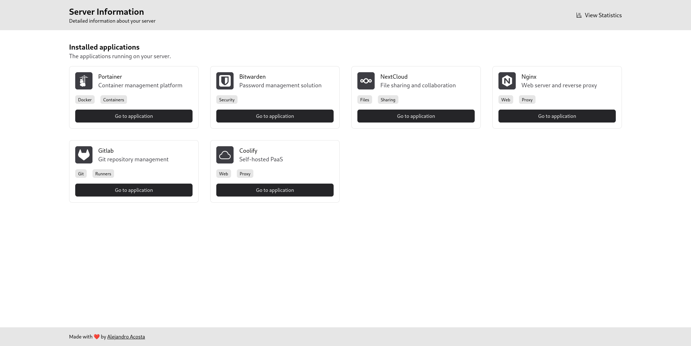

# Server summary

This is a simple web app that shows a summary of your server's hardware and software.



## Installation

1. Clone the repository
2. Creates a `.env` file with the following content:

```
# For monitoring server using grafana or something similar
PUBLIC_STATS_URL=https://api.server.com/stats
```

3. Create a '/data/apps.json' file with the following content:

```json
[
  {
    "title": "My application",
    "description": "My application description",
    // Should be a simple-icons or carbon icon
    "icon": "icon",
    "tags": ["Apps", "Tags"],
    "url": "https://myapp.com"
  }
]
```

4. Run `npm install`
5. Run `npm run dev`
